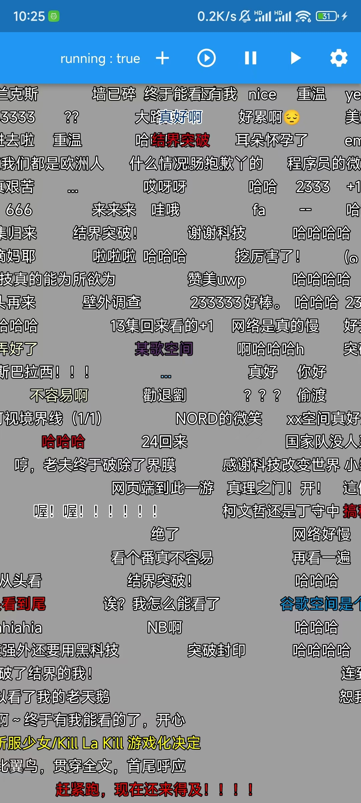

一个简单的Flutter弹幕组件。

## 截图

|  DEMO  |  案例  |
|  ----  | ----  |
|   |  |


## 说明

`debug`模式下会卡顿掉帧，请在`profile`及`release`模式下运行查看实际效果。

在一些机型上加载较多弹幕会掉帧，如果有好的优化方案，欢迎PR。

## 示例

``` yaml
dependencies: 
  # 请使用Git引用此包
  ns_danmaku: 
    git: 
        url: https://github.com/xiaoyaocz/flutter_ns_danmaku.git
        ref: master
```

Example:

```dart

import 'package:ns_danmaku/ns_danmaku.dart';

class _DanmakuPageState extends State<DanmakuPage> {
  late DanmakuController _controller;
  @override
  Widget build(BuildContext context) {
    return Stack(
      children: [
        //Your container, such as a player
        Container(),
        // Danmaku
        DanmakuView(
          createdController: (e) {
            _controller = e;
          },
          option: DanmakuOption(),
        ),
      ],
    );
}

```

## 更新修改

### v0.0.6

- 增加FontWeight配置
- 修改`borderText` -> `strokeText`

## 参考及引用

[xiaoyaocz/NSDanmaku](https://github.com/xiaoyaocz/NSDanmaku) `本项目的UWP版，有兴趣可以看看`

[https://zhuanlan.zhihu.com/p/159027974](https://zhuanlan.zhihu.com/p/159027974)

[https://www.zhihu.com/question/370464345](https://www.zhihu.com/question/370464345)

[LaoMengFlutter/flutter-do](https://github.com/LaoMengFlutter/flutter-do/tree/master/flutter_barrage_sample)
